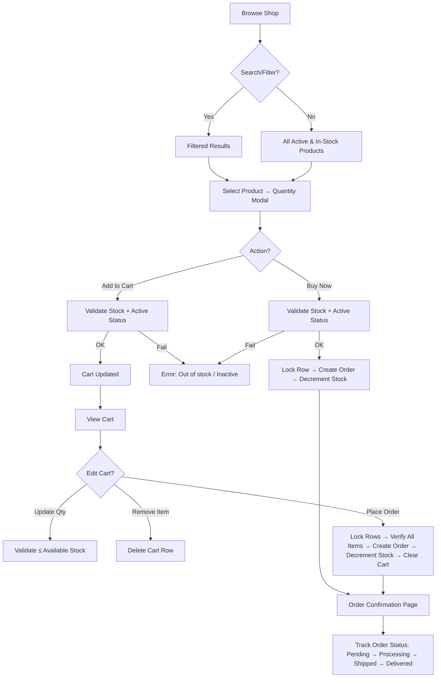
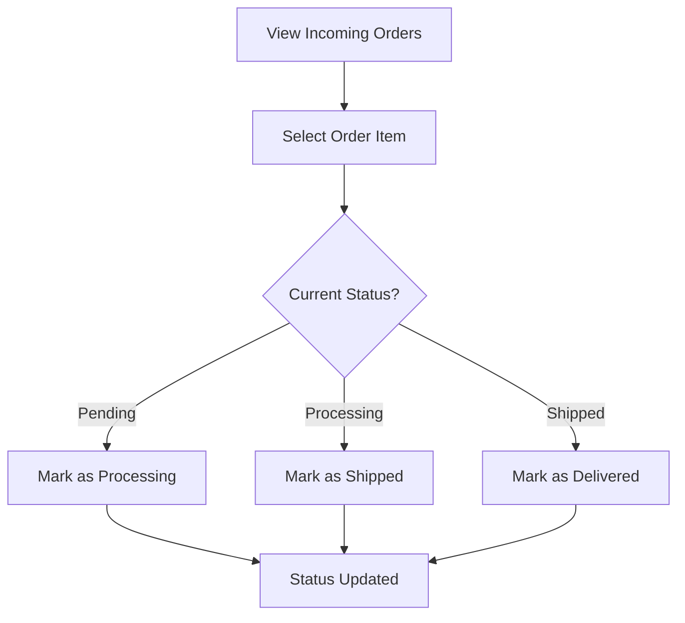
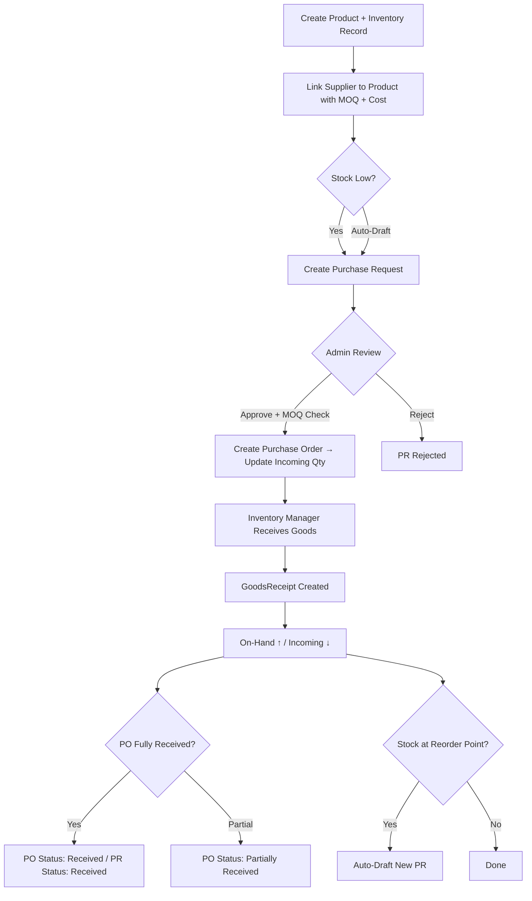
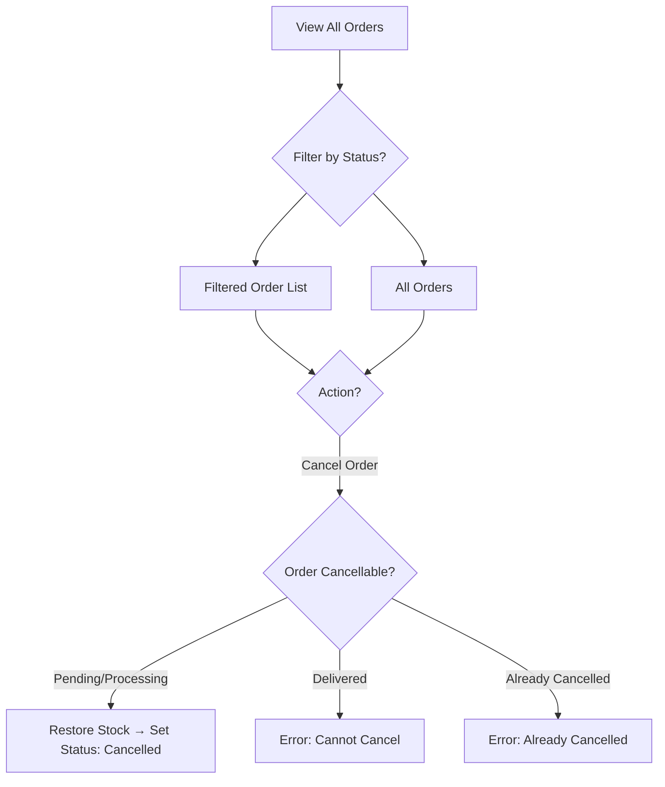

# SKIMS Shop — E-Commerce Process Analysis & Fixes

> **Date**: July 25, 2026  
> **Scope**: Full analysis of all e-commerce processes — from product listing to order fulfillment and supply chain management.

---

## Table of Contents

1. [System Overview](#system-overview)
2. [Customer E-Commerce Flow](#customer-e-commerce-flow)
3. [Supplier Management Flow](#supplier-management-flow)
4. [Admin & Supply Chain Flow](#admin--supply-chain-flow)
5. [Inventory Manager Flow](#inventory-manager-flow)
6. [Flaws Found & Fixes Applied](#flaws-found--fixes-applied)
7. [Complete Process Flow (Post-Fix)](#complete-process-flow-post-fix)

---

## System Overview

The application is a **Laravel + Inertia.js (Vue 3)** e-commerce platform with four user roles:

| Role | Prefix | Purpose |
|------|--------|---------|
| **Customer** | `/customer` | Browse, cart, buy, track orders |
| **Supplier** | `/supplier` | Manage inventory items, fulfill orders |
| **Admin** | `/admin` | Manage users, view orders, supply chain (products, suppliers, PRs, POs) |
| **Inventory Manager** | `/inventory-manager` | Receive goods, monitor supply inventory |

### Two Inventory Systems

The codebase has **two parallel inventory systems** that serve different purposes:

1. **`inventory_items` table** — Supplier-facing marketplace inventory (stock listed for sale to customers)
2. **`inventories` table** — Admin supply-chain inventory (on-hand qty, incoming qty, reorder points for products)

These are **intentionally separate** — one for the B2C storefront, one for internal supply chain management.

---

## Customer E-Commerce Flow

### Process Steps (Post-Fix)

```
1. Browse Shop      → GET /customer/shop (CatalogController@index)
2. Search/Filter    → Query string: ?search=keyword
3. Select Product   → Opens quantity modal (Vue component)
4. Add to Cart      → POST /customer/cart (CartController@store)
   OR Buy Now       → POST /customer/orders (OrderController@store with inventory_item_id)
5. View Cart        → GET /customer/cart (CartController@index)
6. Update Quantity  → PUT /customer/cart/{id} (CartController@update)
7. Remove Item      → DELETE /customer/cart/{id} (CartController@destroy)
8. Place Order      → POST /customer/orders (OrderController@store from cart)
9. View Orders      → GET /customer/orders (OrderController@index)
10. View Order Detail → GET /customer/orders/{id} (OrderController@show)
```

---

## Supplier Management Flow

### Process Steps

```
1. Dashboard         → GET /supplier/ (stats: products, stock, orders, revenue)
2. Manage Inventory  → GET /supplier/inventory (list all items)
3. Add Item          → POST /supplier/inventory (create new SKU)
4. Update Item       → PUT /supplier/inventory/{id} (edit name, stock, price, status)
5. Delete Item       → DELETE /supplier/inventory/{id} (with safety check)
6. View Orders       → GET /supplier/orders (order items assigned to this supplier)
7. Update Status     → PUT /supplier/orders/{id} (pending→processing→shipped→delivered)
8. View Purchase Requests → GET /supplier/purchase-requests (PRs from admin)
```

---

## Admin & Supply Chain Flow

### Process Steps

```
1. Dashboard         → GET /admin/ (users, orders, revenue, products stats)
2. User Management   → GET /admin/users, PUT /admin/users/{id}
3. Order Management  → GET /admin/orders, POST /admin/orders/{id}/cancel
4. Supplier CRUD     → /admin/suppliers (create, read, update, deactivate)
5. Product CRUD      → /admin/products (create, read, update, deactivate)
6. Link Products     → POST /admin/suppliers/{id}/link-product (with MOQ + unit cost)
7. Purchase Requests → /admin/purchase-requests (create, approve, reject)
8. Purchase Orders   → /admin/purchase-orders (view, track receiving)
```

---

## Inventory Manager Flow

### Process Steps

```
1. Dashboard            → GET /inventory-manager/ (product count, low stock, etc.)
2. View Inventory       → GET /inventory-manager/supply-inventory
3. Update Reorder Point → PATCH /inventory-manager/supply-inventory/{id}
4. Receive Goods        → GET /inventory-manager/goods-receipts/create
5. Process Receipt      → POST /inventory-manager/goods-receipts
   → Creates GoodsReceipt record
   → Updates inventory (on_hand ↑, incoming ↓)
   → Updates PO status (partially_received / received)
   → Updates PR status to match
   → Auto-drafts reorder PR if stock hits reorder point
```

---

## Flaws Found & Fixes Applied

### 🔴 Critical Flaws (Data Integrity / Security)

#### 1. Race Condition in Order Placement
- **File**: `OrderController.php`
- **Problem**: Stock was checked *before* the DB transaction, then decremented *inside* it. Two concurrent requests could both pass the stock check and oversell.
- **Fix**: Moved stock check inside the transaction with `lockForUpdate()` (pessimistic locking) to ensure atomicity.

#### 2. Cart Quantity Exceeded Available Stock
- **File**: `CartController.php`
- **Problem**: The `update` method had zero stock validation — a customer could set cart quantity to 999 even if only 5 items exist.
- **Fix**: Added stock validation in `update()`. Also fixed `store()` to check combined quantity (existing cart + new addition) against stock.

#### 3. Cart Checkout Didn't Re-verify Product Active Status
- **File**: `OrderController.php`
- **Problem**: Cart checkout only checked `stock`, not whether the product was still `active`. A supplier could set an item to `hidden`/`draft` between cart-add and checkout, and the customer could still buy it.
- **Fix**: Cart checkout now verifies both `status === 'active'` AND stock availability with row locks.

#### 4. Supplier Could Delete Items With Active Orders
- **File**: `SupplierInventoryController.php`
- **Problem**: `destroy()` performed a hard delete without checking if the item had active orders. This would cascade-delete order_items (due to `cascadeOnDelete` FK), silently destroying order history.
- **Fix**: Added a check for active orders (not delivered/cancelled). Returns error suggesting "hidden" status instead.

#### 5. Unsafe Supplier Auto-Linking
- **File**: `Supplier/PurchaseRequestController.php`
- **Problem**: If a supplier user had no `supplier_id`, the code would auto-link them to `Supplier::first()` (the first supplier in the DB!) or create a brand-new factory. Any supplier user visiting the page would silently inherit another factory's data.
- **Fix**: Removed auto-linking. Now returns an error message asking the user to contact an admin.

#### 6. SQL Wildcard Injection in Search
- **File**: `CatalogController.php`
- **Problem**: User search input was interpolated directly into `LIKE` queries without escaping `%` and `_` wildcards, allowing users to craft queries matching unintended patterns.
- **Fix**: Added `str_replace` to escape LIKE wildcards before interpolation.

---

### 🟡 Logic Flaws (Business Logic Errors)

#### 7. No Order Status Transition Validation
- **File**: `SupplierOrderController.php`
- **Problem**: A supplier could skip steps — e.g., jump directly from `pending` to `delivered`, bypassing `processing` and `shipped`.
- **Fix**: Added an allowed-transitions map that enforces `pending → processing → shipped → delivered`.

#### 8. No Order Cancellation with Stock Restoration
- **File**: `AdminOrderController.php`
- **Problem**: Admins had no way to cancel orders. If an order needed to be cancelled, stock was permanently lost.
- **Fix**: Added `cancel()` method that restores stock to each inventory item and sets order status to `cancelled`. Prevents cancelling already-delivered orders.

#### 9. Missing `casts` on Order and OrderItem Models
- **Files**: `Order.php`, `OrderItem.php`
- **Problem**: The `total` field on Order and `price` on OrderItem had no casts. PHP could treat them as strings during arithmetic, leading to floating-point precision issues.
- **Fix**: Added `'total' => 'decimal:2'` cast to Order, and `'price' => 'decimal:2'`, `'quantity' => 'integer'` to OrderItem.

---

### 🟠 UX / Frontend Flaws

#### 10. Currency Symbol Inconsistency
- **File**: `OrderDetail.vue`
- **Problem**: Unit price showed `$` while everything else (totals, cart, shop) used `₱` (Philippine Peso).
- **Fix**: Changed `$` to `₱` on line 93.

#### 11. Cart Quantity Increment Not Capped
- **File**: `Cart.vue`
- **Problem**: The `+` button in the cart had no upper bound — users could increment quantity infinitely past available stock on the frontend.
- **Fix**: Added `:disabled="item.quantity >= (item.inventory_item?.stock || 0)"` and disabled styling.

#### 12. Double-Submit on Place Order
- **File**: `Cart.vue`
- **Problem**: The "Place Order" button had no loading state or double-click prevention. Rapid clicks could submit multiple order requests.
- **Fix**: Added `isSubmitting` ref, disabled button during submission, and shows "Placing Order..." text.

---

### 🔵 Architectural Observations (Not Fixed — Informational)

| # | Observation | Notes |
|---|------------|-------|
| A | Two separate inventory systems | `inventory_items` (supplier marketplace) and `inventories` (supply chain) are not linked — this is by design but could cause confusion |
| B | No customer order cancellation | Customers cannot cancel their own orders — only admins can. Consider adding a cancel route under `/customer/orders/{id}/cancel` for pending orders |
| C | No email notifications | No order confirmation, shipping updates, or low-stock alerts are sent via email |
| D | No payment integration | Orders are placed without any payment processing. Status goes directly to "pending" |
| E | `order_items.supplier_id` references `users` table | The FK points to users (supplier users), not the `suppliers` table. This is technically functional but semantically confusing |
| F | No order number generation | Orders use auto-increment IDs (Order #1, #2...) instead of proper order numbers like `ORD-20260725-XXXX` |
| G | No image upload for inventory items | `image_url` is a plain URL field — no file upload handling. Products (admin) have proper photo upload |

---

## Complete Process Flow (Post-Fix)

### Customer Journey



### Supplier Order Fulfillment



### Admin Supply Chain



### Admin Order Management



---

## Files Modified

| File | Changes |
|------|---------|
| `app/Http/Controllers/Customer/CartController.php` | Stock validation on store & update |
| `app/Http/Controllers/Customer/OrderController.php` | Pessimistic locking, active status check, error handling |
| `app/Http/Controllers/Customer/CatalogController.php` | SQL wildcard escaping |
| `app/Http/Controllers/Admin/AdminOrderController.php` | Added cancel with stock restore |
| `app/Http/Controllers/Supplier/SupplierOrderController.php` | Status transition validation |
| `app/Http/Controllers/SupplierInventoryController.php` | Delete safety for active orders |
| `app/Http/Controllers/Supplier/PurchaseRequestController.php` | Removed unsafe auto-linking |
| `app/Models/Order.php` | Added casts, isCancellable helper |
| `app/Models/OrderItem.php` | Added casts |
| `resources/js/Pages/Customer/Cart.vue` | Stock cap, double-submit prevention |
| `resources/js/Pages/Customer/OrderDetail.vue` | Currency symbol fix |
| `routes/web.php` | Added admin order cancel route |
